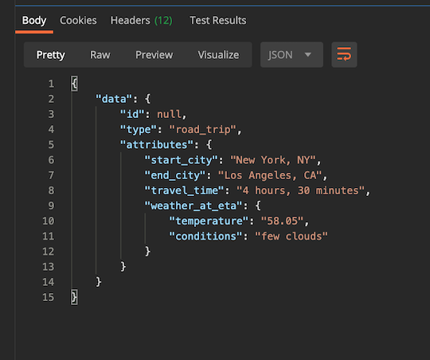
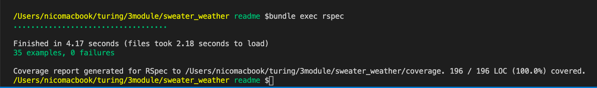
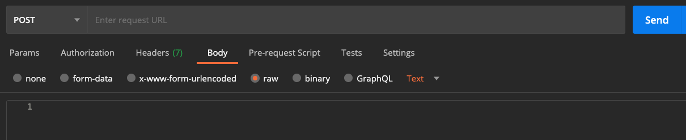
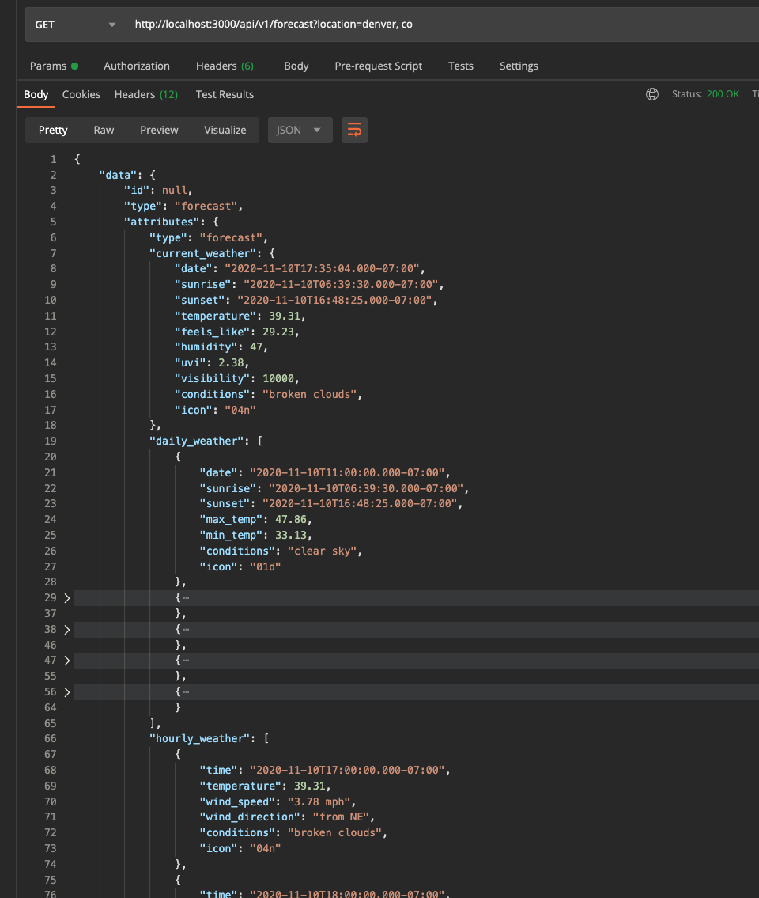
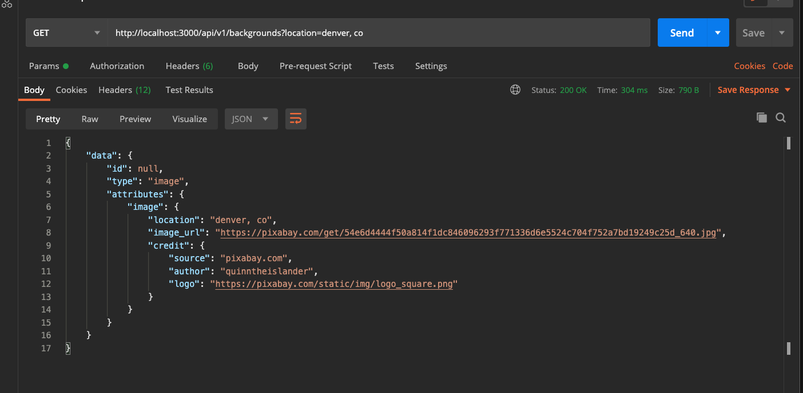
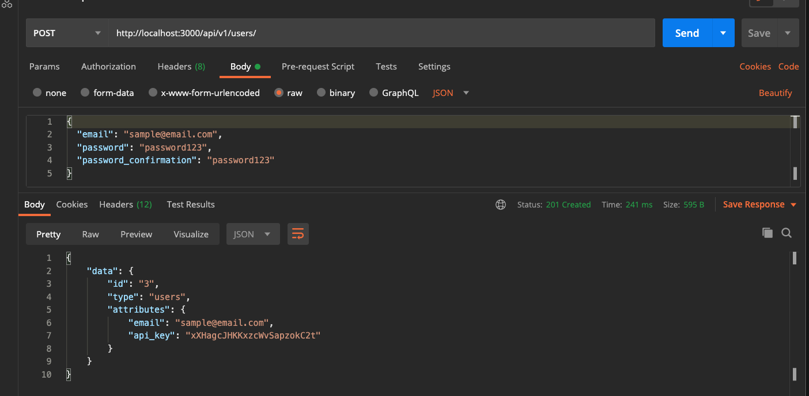
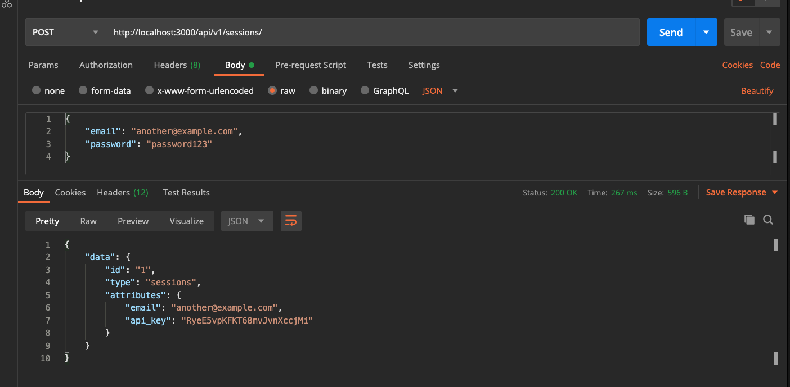
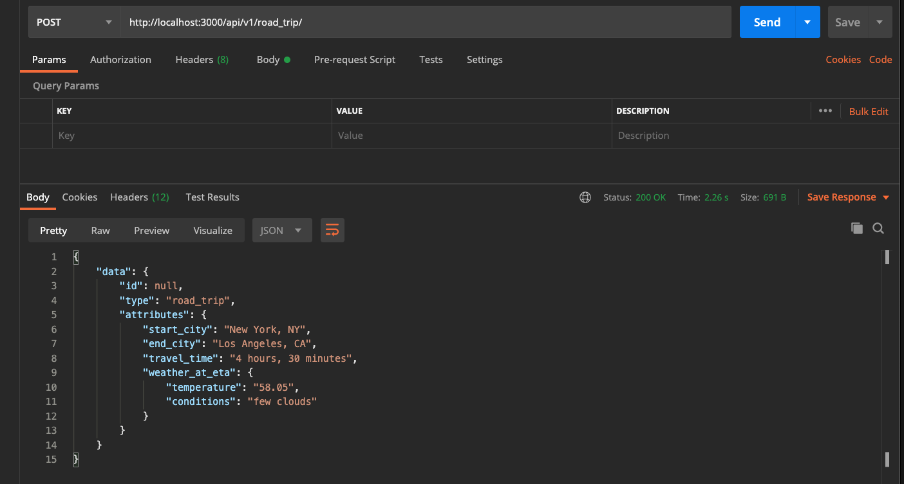

# Sweater Weather


<div align="center">
  
  ## An API Rails App Project
  
     
  
  <p> Backend Development - Cohort 2006</p>
  <small>Nico Rithner - 2020</small>
</div>

## Table of Contents

- [Overview](#overview)
- [Specifications](#specifications)
- [Installation](#installation)
- [Testing](#testing)
- [Endpoints](#api-endpoints)

## Overview

[Sweater Weather](https://backend.turing.io/module3/projects/sweater_weather/requirements) is a Turing Module 3 project that provides the developer with a series of wireframes and instructions to produce endpoints that the project front-end developers (ficticious) could use.
Using request such as `GET /api/v1/forecast?location=denver,co` the app can

- retrieve the weather for a city,
- retrieve a background image for that city,
- register and user,
- log an existing user and
- plan a road trip (duration of the trip and weather at arrival)

<br/>

<p align="center">
<br/>
<small>sample wireframe</small>
<p>

<p align="left">
  
The projects asks for T.D.D. (test driven development) to develop the project functionality. Gems such as **simplecov**, **webmock**, and **vcr**, among others help us drive this process.<br/>
The testing requirements expect 'sad path' path testing along with functionality. This means to test for when the user doesn't do what is expected. For example, entering the wrong password or omitting the confirmation password.

</p>

<p align="center">
<br/>
<small>sample json</small>
</p>

[back to top](#table-of-contents)

<hr>

## Specifications

This project runs on `Rails: 6.0.34` and `Ruby: 2.5.3`<br/>

To check your current versions, run:
```ruby
$ ruby -v
ruby 2.5.3p105 (2018-10-18 revision 65156) [x86_64-darwin19]
$ rails -v
Rails 6.0.3.4
```
<br/>
<hr>

### Gems

This project uses the following additional gems:<br/>
You can find the most current version at [Rubygems.org](https://rubygems.org/)

#### Production

<ul>
<li><a href="https://rubygems.org/gems/bcrypt">bcrypt:</a> <small> The bcrypt Ruby gem provides a simple wrapper for safely handling passwords.</small></li>
<li><a href="https://rubygems.org/gems/faraday">faraday:</a> <small>HTTP/REST API client library</small></li>
<li><a href="https://rubygems.org/gems/figaro">figaro:</a> <small>Simple, Heroku-friendly Rails app configuration using ENV and a single YAML file</small></li>
<li><a href="https://rubygems.org/gems/jsonapi-serializer">jsonapi-serializer:</a> <small>Fast, simple and easy to use JSON:API serialization library (also known as fast_jsonapi).</small></li>
</ul>

#### Test and Development

<ul>
<li><a href="https://rubygems.org/gems/pry">pry:</a> <small>Pry is a runtime developer console and IRB alternative that attempts to bring REPL driven programming to the Ruby language </small></li>
<li><a href="https://rubygems.org/gems/rspec-rails">rspec-rails:</a> <small>rspec-rails is a testing framework for Rails 5+</small></li>
<li><a href="https://rubygems.org/gems/rubocop">rubocop:</a> <small>RuboCop is a Ruby code style checking and code formatting tool. It aims to enforce the community-driven Ruby Style Guide.</small></li>
<li><a href="https://rubygems.org/gems/simplecov">simplecov:</a> <small>Code coverage for Ruby with a powerful configuration library and automatic merging of coverage across test suites</small></li>
<li><a href="https://rubygems.org/gems/shoulda-matchers">shoulda-matchers:</a> <small>Shoulda Matchers provides RSpec compatible one-liners to test common Rails functionality</small></li>
<li><a href="https://rubygems.org/gems/webmock">webmock:</a> <small>WebMock allows stubbing HTTP requests and setting expectations on HTTP requests.</small></li>
<li><a href="https://rubygems.org/gems/vcr">vcr:</a> <small>Record your test suite's HTTP interactions and replay them during future test runs for fast, deterministic, accurate tests</small></li>
</ul>

### APIs

In this project we used the following APIs:

<ul>
<li><a href="https://openweathermap.org/appid">OpenWeather:</a> <small> Weather information for any location on the globe. Some apis are paid. We used OneCall </small></li>
<li><a href="https://developer.mapquest.com/user/me/apps">MapQuest Developer:</a> <small> Mapping, Geocoding, Directions, and Search provider. Free and paid APIs</small></li>
<li><a href="https://pixabay.com/service/about/api/">Pixabay Developer API:</a> <small> Access to over 2.1 million photos, illustrations, vector graphics, and videos.</small></li>
</ul>

[back to top](#table-of-contents)

<hr>

## Installation

### Fork and Clone The Repo

Fork this Github repository: [Sweater_weather](https://github.com/nicorithner/Sweater_weather)

Clone your 'Sweater_weather' repository using SSH:
```
  $ git clone git@github.com:<your-github-username>/Sweater_weather.git
```

### Initial Installation

In the command line run the following commands in order:

1. `$ rails db:{create,migrate}`
2. `$ rails generate rspec:install`
3. `$ bundle exec figaro install`
5. `$ bundle install`

### Set Up API Keys

Find the `application.yml` file in the config folder and add your API keys
example:
```ruby
MAP_API_KEY: <api key here without strings>
WEATHER_API_KEY: <api key here without strings>
IMAGE_API_KEY: <api key here without strings>
```
[back to top](#table-of-contents)

<hr>

## Testing

### RSpec

<p> We can check the test on the spec folder by running rspec</p>

In the command line run<br/>

`$ bundle exec rspec`

All tests should be passing.

If you get a `nil` or a `vcr` error,
you may need to delete `vcr_cassettes` in the `/spec/fixtures` folder.

### Simplecov

After running the tests simplecov gathers the coverage and neatly reports them in an html page.

In the command line you should see something like this:<br/>

`Coverage report generated for RSpec to /Users/nicomacbook/turing/3module/sweater_weather/coverage. 196 / 196 LOC (100.0%) covered.`

<p align="center">
<br/>
<small>sample rspec/simplecov terminal output</small>
</p>

### Rubocop

Rubocop helps us clean up the code.

In the command line run:

`$ rubocop`

Rubocop will highlight styling errors - according to rails standards - and make recommendations on how to improve the code.

[back to top](#table-of-contents)

<hr>

## API Endpoints

The exposing these endpoints is the chief purpose of this application. To test this out your self in your computer follow the instructions below. 

### Expose the endpoints in **Postman**

1. Open the terminal in your computer and navigate to where `sweater_weather` is located and `cd` into it.
2. Once in the directory run the following command in your terminal:
    `$ rails server`
3. Open **Postman** and type the following in the address bar:
    `http://localhost:3000/`
4. Add the requests below to call each endpoint.
    example: `http://localhost:3000/api/v1/backgrounds?location=denver,co`
5. Change the verb to one corresponding to the call
    for example: `Post`
6. Send your request by clicking `Send`


**Notice** that some of the call require you add the paramteres to the body.
In postman:
  1. Click on `body`
  2. Select `raw`
  3. Select `json` (by default show as `text`)


<p align="center">
<br/>
<small>sample Postman setup</small>
</p>


### Forecast

#### Retrieve weather for a city

Shows the current, hourly, and daily forecast for the location queried. It accepts city and state as parameters.

Request:
- Content-Type: application/json
- Accept: application/json

<div align="center">

**get**  `api/v1/forecast?location=denver, co`

</div><br/>


<p align="center">
<br/>
<small>sample forecast request</small>
</p>

<div align="center">

#### Test it Out In Postman

[](https://app.getpostman.com/run-collection/39bdebc6f173b246f3cc)

</div>

[back to top](#table-of-contents)

### Background Image

#### Retrieves background Image for the City

Using Pixabay's API, retrieves an image that is related to the searched location and outputs a serialized json.

Request:
- Content-Type: application/json
- Accept: application/json

<div align="center">

**get**  `api/v1/backgrounds?location=denver, co`
</div><br/>

<p align="center">
<br/>
<small>sample background request</small>
</p>

<div align="center">

#### Test it Out In Postman

[](https://app.getpostman.com/run-collection/39bdebc6f173b246f3cc)

</div>

[back to top](#table-of-contents)

### User Registration

#### Registers a new user

Registers a new user and generates a unique API key for the user

Request:

- Content-Type: application/json
- Accept: application/json

The params are passed on in the body of the request not in the uri:

```json
{
  "email": "whatever@example.com",
  "password": "password",
  "password_confirmation": "password"
}
```

<div align="center">

**post**  `/api/v1/users`
</div><br/>

<p align="center">
<br/>
<small>sample users request</small>
</p>

[back to top](#table-of-contents)

<div align="center">

#### Test it Out In Postman

[](https://app.getpostman.com/run-collection/39bdebc6f173b246f3cc)

</div>

### User Login

#### Authenticates a User 

This request authenticates a user and logs it into the application

Request:
- Content-Type: application/json
- Accept: application/json

```json
{
  "email": "whatever@example.com",
  "password": "password"
}
```

<div align="center">

**post**  `/api/v1/sessions`

</div><br/>
<p align="center">
<br/>
<small>sample login request</small>
</p>

<div align="center">

#### Test it Out In Postman

[](https://app.getpostman.com/run-collection/39bdebc6f173b246f3cc)

</div>

[back to top](#table-of-contents)

### Road Trip

#### Returns estimated travel time and arrival forecast for a road trip

This request produces trip duration and destination weather forecast at eta.

Request:
- Content-Type: application/json
- Accept: application/json

```json
{
  "origin": "Denver,CO",
  "destination": "Pueblo,CO",
  "api_key": "jgn983hy48thw9begh98h4539h4"
}
```

<div align="center">

**post**  `/api/v1/road_trip`

</div><br/>
<p align="center">
<br/>
<small>sample road_trip request</small>
</p>

<div align="center">

#### Test it Out In Postman

[](https://app.getpostman.com/run-collection/39bdebc6f173b246f3cc)

</div>

[back to top](#table-of-contents)
