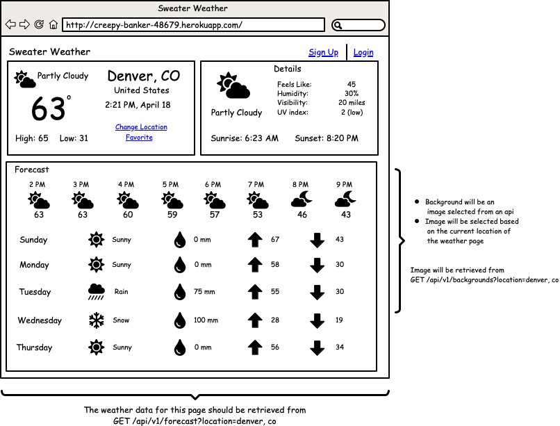

# Sweater Weather

<div align="center">
  <p><strong>An API Rails App Project</strong></p>
  <p> Backend Development - Cohort 2006</p>
  <small>Nico Rithner - 2020</small>
</div>

## Table of Contents

- [Overview](#overview)
- [Specifications](#specifications)

## Overview

[Sweater Weather](https://backend.turing.io/module3/projects/sweater_weather/requirements) is a Turing Module 3 project that provides the developer with a series of wireframes and instructions to produce endpoints that the project front-end developers (ficticious) could use.
Using request such as `GET /api/v1/forecast?location=denver,co` the app can

- retrieve the weather for a city,
- retrieve a background image for that city,
- register and user,
- log an existing user and
- plan a road trip (duration of the trip and weather at arrival)

<br/>

<p align="center">
<br/>
<small>sample wireframe</small>
<p>

<p align="left">
The projects asks to using T.D.D. (test driven development) to develop the project functionality. Gems such as **simplecov**, **webmock**, and **vcr**, among others help us drive this process.
The testing requirements expected 'sad path' path testing along with functionality. This means to test for when the user doesn't do what is expected. For example, entering the wrong password or omitting the confirmation password.
</p>

<p align="center">
<br/>
<small>sample json</small>
</p>

<hr>

## Specifications

   

This project runs on `Rails: 6.0.34` and `Ruby: 2.5.3`<br/>

To check your current versions, run:
```ruby
$ ruby -v
ruby 2.5.3p105 (2018-10-18 revision 65156) [x86_64-darwin19]
$ rails -v
Rails 6.0.3.4
```

This project uses the following additional gems:<br/>
You can find the most current version at [Rubygems.org](https://rubygems.org/)

### Production

<ul>
<li><a href="url">bcrypt:</a> <small> The bcrypt Ruby gem provides a simple wrapper for safely handling passwords.</small></li>
<li><a href="url">faraday:</a> </li>
<li><a href="url">figaro:</a> </li>
<li><a href="url">jsonapi-serializer:</a> </li>
</ul>

### Test and Development

<ul>
<li><a href="url">capybara:</a> </li>
<li><a href="url">launchy:</a> </li>
<li><a href="url">pry:</a> </li>
<li><a href="url">rspec-rails:</a> </li>
<li><a href="url">rubocop:</a> </li>
<li><a href="url">simplecov:</a> </li>
<li><a href="url">shoulda-matchers:</a> </li>
<li><a href="url">webmock:</a> </li>
<li><a href="url">vcr:</a> </li>
</ul>


